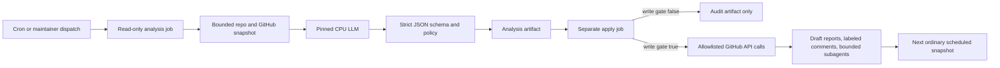

# Githubinference

Githubinference is an experiment in running a useful, repository-aware LLM entirely on a GitHub-hosted CPU runner. The first caretaker is LiquidAI's LFM2.5 2.6B GGUF. It can inspect a bounded snapshot of this repository, issues, pull requests, previous subagent artifacts, and recent workflow state; then it returns structured proposals to a deterministic policy layer.

The experiment is deliberately not an unrestricted autonomous bot. Model text is untrusted. The model never receives a write-capable token, never executes shell commands, never merges, and never applies its own patches. A separate short-lived job can perform a small allowlist of auditable GitHub operations only when the repository variable `CARETAKER_WRITE_ENABLED` is exactly true.

## What is implemented

- A six-hour cron cadence (`17 */6 * * *`) with a normal 45-minute internal budget.
- Pinned, SHA256-verified llama.cpp and GGUF downloads.
- LFM2.5 2.6B Q4_K_M as the primary model and LFM2.5 1.2B as a low-memory fallback.
- A bounded, JSON-only caretaker loop with at most four turns and eight proposed actions.
- Read-only repository, issue, PR, workflow, model-scout, and subagent context.
- Deterministic policy checks before every possible GitHub write.
- Label-gated issue/PR comments, idempotent issues, draft report PRs, and at most two read-only subagent dispatches.
- Report-only model discovery. A model cannot promote itself.
- A manual Gemma 4 E2B IT benchmark lane, with optional pinned MTP assistant.
- A manual, temporary OpenAI-compatible endpoint through a named Cloudflare Tunnel and a loopback bearer-token gateway.
- Unit tests plus a real LFM CPU inference smoke test in Actions.

## System flow



The model's `continuation: "continue"` choice means “checkpoint and revisit on the next normal schedule.” It does **not** recursively restart a workflow to evade GitHub's hosted-job limit. GitHub documents a six-hour maximum for standard hosted jobs, while scheduled workflows can be delayed or dropped during high load. The 340-minute hard ceiling leaves time for cleanup and artifact upload.

## Workflows

| Workflow | Trigger | Authority | Purpose |
|---|---|---:|---|
| `CI` | PR, main push, manual | read-only | Unit/config/source checks |
| `CPU model smoke` | relevant PR, manual | read-only | Download, digest-check, load, and infer with LFM |
| `CPU repository caretaker` | every six hours, manual | split | Read-only model analysis, then policy-gated apply |
| `Read-only CPU subagent` | bounded dispatch | read-only | Independent analysis returned as an artifact |
| `Manual CPU model benchmark` | manual | read-only | Compare pinned LFM/Gemma targets and optional MTP |
| `Temporary authenticated inference endpoint` | manual only | read-only | Serve a keyed endpoint for 5-330 minutes (up to 5h30m) |

Scheduled workflows run from the default branch, so the caretaker begins only after this implementation is merged. GitHub may disable schedules after 60 days without repository activity.

## Safe activation

The repository ships in report-only mode. Leave it there for the first successful model smoke and caretaker run:

```bash
gh variable set CARETAKER_WRITE_ENABLED --repo adybag14-cyber/Githubinference --body false
gh workflow run model-smoke.yml --repo adybag14-cyber/Githubinference
gh workflow run caretaker.yml --repo adybag14-cyber/Githubinference
```

Inspect the `caretaker-analysis-*` and `caretaker-apply-*` artifacts. When the results are sensible, a maintainer can enable only the bounded apply lane:

```bash
gh variable set CARETAKER_WRITE_ENABLED --repo adybag14-cyber/Githubinference --body true
```

Apply mode permits only:

- one idempotent issue per run;
- up to three idempotent comments, and only on issues/PRs carrying `caretaker:review`;
- report-only patch/model/checkpoint files in a draft PR under `.caretaker/`;
- up to two `subagent.yml` dispatches.

It cannot auto-merge, push to `main`, execute model-generated code, edit workflows/policy/security files, change repository settings, read secrets, or recursively restart the caretaker.

## Temporary inference endpoint

The endpoint is intentionally manual and ephemeral because a GitHub-hosted runner is not a production server. Configure the `inference` environment with:

- secret `INFERENCE_API_KEY`: a randomly generated value of at least 32 characters;
- secret `CLOUDFLARE_TUNNEL_TOKEN`: a token for a named, remotely managed Cloudflare Tunnel;
- variable `INFERENCE_PUBLIC_URL`: the tunnel hostname, for example `https://inference.example.com`.

Configure the tunnel's public hostname to forward to `http://localhost:8787`, then dispatch `endpoint.yml`. llama.cpp listens only on `127.0.0.1:8080`; the gateway listens only on `127.0.0.1:8787`; Cloudflare Tunnel is the only internet-facing transport.

Manual contributor sessions may request 5-330 minutes. The job timeout is 355 minutes, preserving 25 minutes for model startup or fallback, authenticated readiness checks, and trap-based cleanup before GitHub's six-hour hosted-job limit.

Use the endpoint with the key distributed out of band:

```bash
curl https://inference.example.com/v1/chat/completions \
  -H "Authorization: Bearer $INFERENCE_API_KEY" \
  -H "Content-Type: application/json" \
  -d '{"model":"lfm2_5_2_6b_q4_k_m","messages":[{"role":"user","content":"Hello"}],"max_tokens":128,"stream":false}'
```

GitHub secrets are write-only: collaborators cannot retrieve `INFERENCE_API_KEY` from the repository. A maintainer must share the client copy through a secure channel. Rotate it if it is exposed. The gateway limits requests to 1 MiB, responses to 8 MiB, output to 4,096 tokens, disables streaming, allows one inference at a time, and never forwards or logs the bearer key. Endpoint logs and the temporary tunnel-token file are not uploaded as artifacts.

See [operations](docs/OPERATIONS.md) for the exact setup and rollback procedure.

## Models and fallbacks

All runnable artifacts are immutable entries in [config/models.json](config/models.json). A registry entry includes the upstream repository, full revision, filename, exact byte size, SHA256, license, and automatic/manual eligibility.

1. `lfm2_5_2_6b_q4_k_m` — primary automatic caretaker.
2. `lfm2_5_1_2b_q4_k_m` — lower-memory automatic fallback.
3. `gemma4_e2b_it_qat_q4_0` — manual benchmark target because the 3.35 GB QAT GGUF has a larger memory/time footprint.
4. `gemma4_e2b_it_qat_mtp_q8_0` — optional 98 MB MTP assistant, manual because it is a pinned community conversion.

The scheduled caretaker and temporary endpoint retry the official 1.2B model only if the primary's exact process exits before health. Model-smoke and benchmarks never substitute a fallback because that would invalidate their evidence. The model scout can suggest newer candidates only from an allowlist of established publishers. Suggestions remain inert metadata until a maintainer pins the exact artifact and the real benchmark workflow passes. More detail is in [models](docs/MODELS.md).

## Local development

The Python control plane is Python 3.10+ and has no runtime dependencies:

```bash
python -m pip install -e .
python -m githubinference validate
python -m unittest discover -s tests -v
```

On Linux, run a real local smoke test with the pinned runner binary and model:

```bash
bash scripts/local_smoke.sh lfm2_5_2_6b_q4_k_m 18080
```

The script owns one exact server PID, fails if that process exits early, and always cleans it up.

## Important limits

- A hosted runner is ephemeral; no model memory or endpoint survives the job.
- The LLM is not conscious or continuously thinking. Each run is a fresh inference over a bounded snapshot and prior artifacts.
- GitHub's `GITHUB_TOKEN` deliberately does not trigger most new workflow runs from its own writes; subagents use the explicit workflow-dispatch API.
- Public-repository standard runner minutes are currently free, but concurrency, cache, schedule, API, and abuse limits still apply.
- Fork pull requests do not receive secrets, and the endpoint workflow is manual/environment-protected.
- Model output can be wrong or adversarial. Maintainer review remains the promotion and merge boundary.

Read [architecture](docs/ARCHITECTURE.md), [security](SECURITY.md), and [operations](docs/OPERATIONS.md) before enabling writes or the endpoint.

## License

The repository code is Apache-2.0. Model weights retain their own licenses: Liquid models use the Liquid LFM license noted in the registry, while the pinned Gemma artifacts are Apache-2.0. Downloading a model means accepting its upstream terms.
